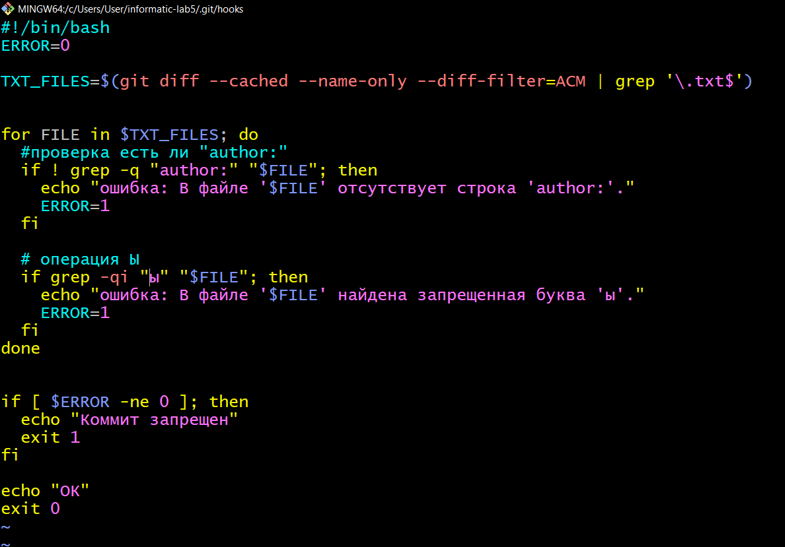
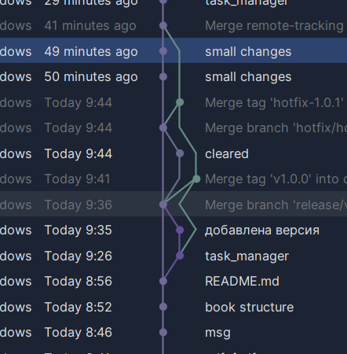
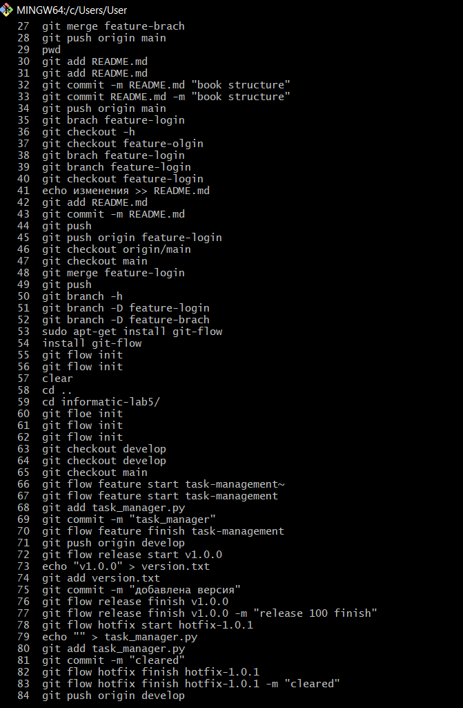

# Лабораторная работа 5
## Предварительные требования:

1. Основы работы с Git.
2. Установленный Git на локальной машине 

## Отчёт
1) создание репозитория
```
https://github.com/Dima51Al/informatic-lab5.git
```
2) клонирование
```shell
git clone https://github.com/Dima51Al/informatic-lab5.git
```
### Задание 1
#### установка pre-commit. Создание pre-commit без .sample

  ```shell
  cd .git/hooks
  touch pre-commit
  chmod +x pre-commit
  ```
   2) Написание bash скрипта для проверки коммита. (должен быть  автор, не должно быть букв ы)

### Задание 2

1) git flow init
2) git flow feature start task-management
3) echo "print('tests passed')" > task_manager.py
4) git add task_manager.py
5) git commit -m "Добавлен функционал управления задачами"
6) git flow feature finish task-management
7) git checkout develop
8) git flow release start v1.0.0
9) echo "v1.0.0" > version.txt
10) git add version.txt
11) git commit -m "Обновлена версия для релиза v1.0.0"
12) git flow release finish v1.0.0
13) git flow hotfix start hotfix-1.0.1
14) git add file_with_error.py
15) git commit -m "Исправлена критическая ошибка"
16) git push origin develop
17) git push origin main

### Вывод
Изучен метод работы с git